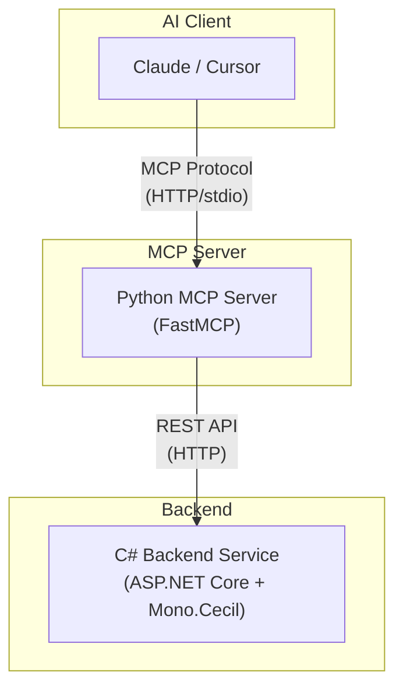

# DotNet MCP Project

> ✅ **v0.4.0 - 功能完整**
> 核心功能已完成，包括分析、修改、MCP 集成。生产环境使用前请进行充分测试。

## 项目概述
基于 MCP (Model Context Protocol) 的 .NET 程序集逆向工程和修改工具。

## 架构




## 功能模块

### Phase 1: 基础设施 ✅
- **Cecil 集成**: 程序集加载和上下文管理
- **ID 系统**: MemberId, LocationId 编解码
- **分页系统**: Cursor-based 分页和切片
- **Roslyn 编译**: C# 代码运行时编译

### Phase 2: 分析能力 ✅
- **索引服务**: TypeIndex, MemberIndex
- **搜索服务**: 统一搜索接口
- **反编译**: 基于 ILSpy 的 C# 反编译
- **交叉引用**: 类型和方法引用查找
- **调用图**: 方法调用图构建

### Phase 3: 修改能力 ✅
- **ILBuilder**: IL 指令序列构建器
- **CodeInjector**: 代码注入器
- **AssemblyRewriter**: 程序集重写器
- **TypeFactory**: 类型工厂
- **DiffComparator**: 差异对比器

### Phase 4: MCP 集成 ✅
- **Python MCP Server**: FastMCP 框架
- **工具注册**: 分析和修改工具
- **REST API 适配**: Python ↔ C# 对接

## 快速开始

### 启动后端服务

```bash
cd backend-service
dotnet run --project src/DotNetMcp.Backend
```

服务将在 `http://localhost:5000` 启动。

### 启动 MCP Server

```bash
cd mcp-server
python dotnetmcp_server.py
```

### 加载程序集

```bash
curl -X POST http://localhost:5000/assembly/load \
  -H "Content-Type: application/json" \
  -d '{"path": "/path/to/assembly.dll"}'
```

### 注入代码示例

```bash
curl -X POST http://localhost:5000/modification/inject/entry \
  -H "Content-Type: application/json" \
  -d '{
    "methodFullName": "MyApp.Program::Main",
    "instructions": [
      {"opCode": "ldstr", "stringValue": "Hello from injected code!"},
      {"opCode": "call", "stringValue": "System.Console::WriteLine"}
    ]
  }'
```

### 保存修改后的程序集

```bash
curl -X POST http://localhost:5000/modification/save \
  -H "Content-Type: application/json" \
  -d '{"outputPath": "/tmp/modified.dll"}'
```

## REST API 端点

### Assembly Management
- `POST /assembly/load` - 加载程序集
- `GET /assembly/info` - 获取程序集信息
- `GET /health` - 健康检查

### Modification
- `POST /modification/inject/entry` - 注入方法入口代码
- `POST /modification/replace/body` - 替换方法体
- `POST /modification/type/add` - 添加新类型
- `POST /modification/method/add` - 添加方法
- `POST /modification/save` - 保存程序集

## MCP 工具

### Analysis Tools
- `get_assembly_info` - 获取程序集信息
- `get_type_source` - 获取类型源码
- `get_method_by_name` - 获取方法源码
- `get_type_info` - 获取类型结构信息
- `search_types_by_keyword` - 搜索类型
- `search_string_literals` - 搜索字符串字面量
- `get_xrefs_to_type` - 查找类型引用
- `get_xrefs_to_method` - 查找方法调用
- `build_call_graph` - 构建调用图
- `build_control_flow_graph` - 构建控制流图 (CFG)
- `build_dependency_graph` - 构建依赖图
- `detect_design_patterns` - 检测设计模式
- `detect_obfuscation` - 检测混淆

### Modification Tools
- `inject_method_entry` - 注入方法入口
- `replace_method_body` - 替换方法体
- `add_type` - 添加类型
- `add_method` - 添加方法
- `save_assembly` - 保存程序集

## 测试

```bash
cd backend-service
dotnet test
```

当前测试状态: **113 个测试全部通过** ✅

## 依赖

### C# Backend
- Mono.Cecil - 程序集操作
- ILSpy (ICSharpCode.Decompiler) - 反编译
- Microsoft.CodeAnalysis (Roslyn) - C# 编译

### Python MCP Server
- fastmcp - MCP 框架
- httpx - HTTP 客户端

## 开发状态

| Phase | 状态 | 测试 |
|-------|------|------|
| Phase 1: 基础设施 | ✅ | 74 个 |
| Phase 2: 分析能力 | ✅ | 19 个 |
| Phase 3: 修改能力 | ✅ | 20 个 |
| Phase 4: MCP 集成 | ✅ | - |

**总测试数**: 113 个 ✅

## License

MIT
