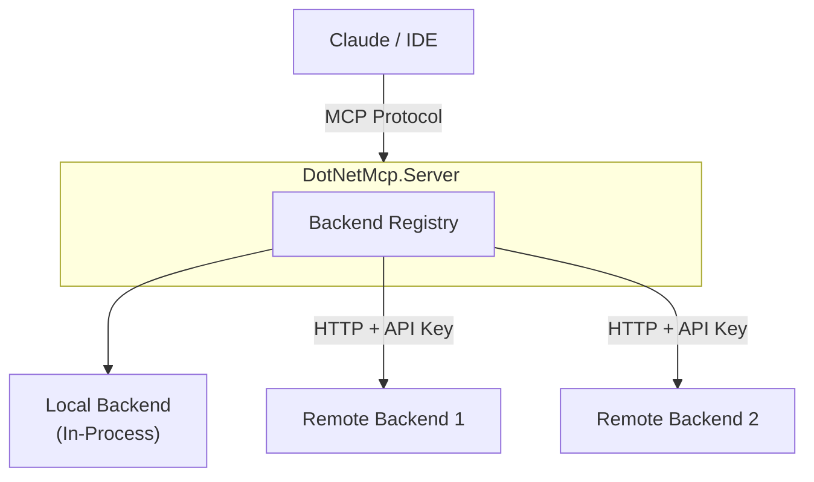

# DotNet MCP

English | [中文](README.zh.md)

> **v0.0.3** - Pure C# Architecture, Unified MCP Server and Backend

A .NET assembly reverse engineering and modification tool based on MCP (Model Context Protocol).

## Documentation

- [Getting Started](docs/en/getting-started.md)
- [AI Usage Guide](docs/en/ai-usage-guide.md)
- [Configuration](docs/en/configuration.md)
- [Tools Reference](docs/en/tools-reference.md)

## Overview

DotNet MCP is a tool that provides .NET assembly analysis and modification capabilities for AI assistants (like Claude). Through the MCP protocol, AI can:

- Load and analyze .NET assemblies (DLL/EXE)
- Decompile types and methods to C# source code or IL
- Search types, methods, and strings (regex / advanced syntax supported)
- Analyze call graphs, control flow graphs, and dependency graphs
- Inspect inheritance chains, interface implementations, and method overrides
- Detect design patterns (Singleton, Factory, Observer, and more)
- Detect obfuscation and identify the obfuscator used
- Auto-detect Unity game assembly paths
- Inject code and modify assemblies

## Architecture


```mermaid
flowchart TB
    subgraph Client["Claude / IDE"]
    end

    Client -->|"MCP Protocol (stdio/HTTP)"| Server

    subgraph Server["DotNetMcp.Server"]
        Tools["MCP Tools (41)<br/>Assembly | Search | Analysis | Modification | Instance"]
        Registry["Backend Registry<br/>(Local / Remote)"]
        Tools --> Registry
    end

    Server --> Backend

    subgraph Backend["DotNetMcp.Backend"]
        Analysis["Core Analysis<br/>Decompiler | CallGraph | CFG | XRef | Search"]
        Modification["Core Modification<br/>ILBuilder | CodeInjector | TypeFactory | Rewriter"]
    end
```

## Security

### API Key Authentication

The Backend service supports API Key authentication for HTTP endpoints.

**Quick Setup:**
```bash
export API_KEYS="your-secret-key"
```

**Supported Headers:**
- `X-API-Key: your-api-key`
- `Authorization: Bearer your-api-key`

**Excluded Paths:** `/`, `/health`, `/openapi` (no authentication required)

> **Note**: In production, always configure API keys. The system will log a critical warning if running in Production without API keys configured.

## Multi-Backend Architecture


```mermaid
flowchart TB
    Client["Claude / IDE"] -->|"MCP Protocol"| Server

    subgraph Server["DotNetMcp.Server"]
        Registry["Backend Registry"]
    end

    Registry --> Local["Local Backend<br/>(In-Process)"]
    Registry -->|"HTTP + API Key"| Remote1["Remote Backend 1"]
    Registry -->|"HTTP + API Key"| Remote2["Remote Backend 2"]
```

### Backend Management via AI

```
# Register backend with API Key authentication
User: Register remote backend http://server:5000 with API key "secret123"

AI: [Call register_remote_backend
     id="analysis-1"
     name="Analysis Server"
     endpoint="http://server:5000"
     apiKey="secret123"]

    Successfully registered remote backend "Analysis Server"

# List all backends
User: List all backends

AI: [Call list_backends]

    Available backends:
    - local (default) - Local, Healthy
    - analysis-1 - Remote, Healthy

# Set default backend
User: Use analysis-1 as default

AI: [Call set_default_backend id="analysis-1"]

    Default backend set to "analysis-1"
```

**Parameters for `register_remote_backend`:**

| Parameter | Required | Description |
|-----------|----------|-------------|
| `id` | Yes | Unique backend ID |
| `name` | Yes | Display name |
| `endpoint` | Yes | HTTP URL |
| `apiKey` | No | API Key for authentication |
| `timeoutSeconds` | No | Timeout (default: 30) |

## Quick Start

### Option A: Download Pre-built Binary (No .NET SDK required)

1. Go to [GitHub Releases](https://github.com/xjoker/DotNetMCP/releases) and download the zip for your platform:

   | Platform | File |
   |----------|------|
   | Windows x64 | `DotNetMcp-win-x64.zip` |
   | Linux x64 | `DotNetMcp-linux-x64.zip` |
   | Linux ARM64 | `DotNetMcp-linux-arm64.zip` |
   | macOS x64 | `DotNetMcp-osx-x64.zip` |
   | macOS ARM64 (Apple Silicon) | `DotNetMcp-osx-arm64.zip` |

2. Extract the zip. You will find a single executable: `DotNetMcp.Server` (or `DotNetMcp.Server.exe` on Windows).

3. **macOS/Linux only** — make it executable:
   ```bash
   chmod +x /path/to/DotNetMcp.Server
   ```

4. Configure Claude Desktop — add to `claude_desktop_config.json`:
   - **Windows**: `%APPDATA%\Claude\claude_desktop_config.json`
   - **macOS**: `~/Library/Application Support/Claude/claude_desktop_config.json`
   - **Linux**: `~/.config/Claude/claude_desktop_config.json`

   ```json
   {
     "mcpServers": {
       "dotnet-mcp": {
         "command": "/path/to/DotNetMcp.Server",
         "args": ["--stdio"]
       }
     }
   }
   ```

   Replace `/path/to/DotNetMcp.Server` with the actual path to the extracted executable.

5. Restart Claude Desktop. The tools are now available.

### Option B: Build from Source (.NET 10.0 SDK required)

```bash
git clone https://github.com/xjoker/DotNetMCP.git
cd DotNetMCP
dotnet build
```

Run in stdio mode (for Claude Desktop):

```bash
dotnet run --project src/DotNetMcp.Server -- --stdio
```

Configure Claude Desktop (source build):

```json
{
  "mcpServers": {
    "dotnet-mcp": {
      "command": "dotnet",
      "args": [
        "run",
        "--project",
        "/path/to/DotNetMCP/src/DotNetMcp.Server",
        "--",
        "--stdio"
      ]
    }
  }
}
```

### Claude Code / Other MCP Clients

```bash
# Stdio mode — using the pre-built binary
claude mcp add dotnet-mcp -- /path/to/DotNetMcp.Server --stdio

# HTTP mode — start server first, then register
dotnet run --project src/DotNetMcp.Server &
claude mcp add dotnet-mcp --transport http --url http://localhost:5000/mcp
```

## MCP Tools

### Assembly Management (4)

| Tool | Description |
|------|-------------|
| `load_assembly` | Load a .NET assembly |
| `list_assemblies` | List loaded assemblies |
| `unload_assembly` | Unload an assembly |
| `detect_unity_assembly` | Auto-detect Assembly-CSharp.dll in a Unity game directory |

### Search Tools (2)

| Tool | Description |
|------|-------------|
| `search_types` | Search types by keyword |
| `search_strings` | Search string literals |

### Analysis Tools (20)

| Tool | Description |
|------|-------------|
| `decompile_type` | Decompile type to C#/IL (supports PDB original source) |
| `decompile_method` | Decompile a single method precisely |
| `find_type_references` | Find type references |
| `find_method_calls` | Find method calls |
| `get_call_graph` | Build call graph |
| `get_control_flow_graph` | Build control flow graph (Mermaid) |
| `get_type_outline` | Get metadata-based type outline (no decompilation) |
| `plan_chunking` | Plan LLM-friendly source code chunks |
| `compare_assemblies` | Compare two assemblies for structural differences |
| `batch_decompile` | Decompile multiple members in one call |
| `get_dependency_graph` | Build assembly/namespace/type dependency graph (Mermaid) |
| `detect_design_patterns` | Detect Singleton, Factory, Observer, and other design patterns |
| `find_base_types` | Find base class chain and interfaces for a type |
| `find_derived_types` | Find all types that inherit from a given type |
| `get_implementations` | Find all implementations of an interface |
| `get_overrides` | Find all overrides of a virtual/abstract method |
| `get_overloads` | Find all overloads of a method within a type |
| `enhanced_search` | Unified search with advanced syntax (regex / +/- / exact / fuzzy / token) |
| `detect_obfuscation` | Detect obfuscation, identify obfuscator, score 0-100 |
| `warm_index` | Pre-build type and member indexes for faster subsequent queries |

### Modification Tools (6)

| Tool | Description |
|------|-------------|
| `inject_at_entry` | Inject code at method entry |
| `replace_method_body` | Replace method body with raw IL instructions |
| `replace_method_body_with_csharp` | Replace method body using C# source code (Roslyn compile + Cecil merge) |
| `add_type` | Add new type |
| `save_assembly` | Save modified assembly |
| `generate_patch_skeleton` | Generate Harmony patch skeleton code |

### Instance Management

#### Backend Management (5)

| Tool | Description |
|------|-------------|
| `list_backends` | List all backends |
| `register_remote_backend` | Register remote backend |
| `unregister_backend` | Unregister backend |
| `set_default_backend` | Set default backend |
| `check_backend_health` | Check backend health |

#### Assembly Alias Management (4)

| Tool | Description |
|------|-------------|
| `register_assembly_alias` | Register a short alias for a loaded assembly MVID |
| `unregister_assembly_alias` | Remove a previously registered alias |
| `list_assembly_aliases` | List all registered aliases (alias → MVID mappings) |
| `instance_restore_persisted` | Reload assemblies from persisted aliases saved in previous session |

## Usage Examples

### Load and Analyze Assembly

```
User: Load /path/to/MyApp.dll and tell me what types it contains

AI: [Call load_assembly]
    [Call search_types keyword=""]

    Loaded assembly MyApp.dll, containing the following types:
    - MyApp.Program (class, 5 methods)
    - MyApp.Services.UserService (class, 10 methods)
    ...
```

### Decompile and Analyze

```
User: Decompile the UserService class

AI: [Call decompile_type typeName="MyApp.Services.UserService"]

    public class UserService
    {
        private readonly IDatabase _db;

        public User GetUser(int id)
        {
            return _db.Query<User>().FirstOrDefault(u => u.Id == id);
        }
        ...
    }
```

### Inject Code

```
User: Add logging at GetUser method entry

AI: [Call inject_at_entry
     methodFullName="MyApp.Services.UserService.GetUser"
     instructions=[
       {"opCode": "ldstr", "stringValue": "GetUser called"},
       {"opCode": "call", "stringValue": "System.Console::WriteLine"}
     ]]

    Logging code injected at GetUser method entry.
```

## Testing

```bash
# Run all tests
dotnet test

# Run Server tests only
dotnet test tests/DotNetMcp.Server.Tests

# Run Backend tests only
dotnet test tests/DotNetMcp.Backend.Tests
```

Current test status:
- Backend tests: 135 passed
- Server tests: 96 passed

## Project Structure

```
DotNetMCP/
├── src/
│   ├── DotNetMcp.Server/          # MCP Server
│   │   ├── Tools/                 # MCP Tool implementations
│   │   ├── Backend/               # Backend registration & management
│   │   └── Configuration/         # Configuration
│   └── DotNetMcp.Backend/         # Core Backend
│       ├── Core/
│       │   ├── Analysis/          # Analysis services
│       │   ├── Modification/      # Modification services
│       │   ├── Context/           # Assembly context
│       │   └── Identity/          # ID system
│       ├── Services/              # Business services
│       └── Controllers/           # HTTP API
├── tests/
│   ├── DotNetMcp.Server.Tests/    # Server unit tests
│   └── DotNetMcp.Backend.Tests/   # Backend unit tests
└── docs/
    ├── zh/                        # Chinese docs
    └── en/                        # English docs
```

## Tech Stack

- **.NET 10.0** - Runtime
- **ModelContextProtocol** - MCP SDK
- **Mono.Cecil** - Assembly manipulation
- **ICSharpCode.Decompiler** - Decompilation
- **Microsoft.CodeAnalysis** - Roslyn compilation

## Docker Deployment

There is no pre-built Docker image published. Build the image from source:

### Build Image

```bash
git clone https://github.com/xjoker/DotNetMCP.git
cd DotNetMCP
docker build -t dotnet-mcp .
```

### Run (HTTP Mode)

The server runs in HTTP mode inside Docker. Mount the directory that contains the DLL/EXE files you want to analyze:

```bash
docker run -p 5000:5000 \
  -v /path/to/your/assemblies:/data \
  dotnet-mcp
```

The server will be available at `http://localhost:5000`.
Health check endpoint: `http://localhost:5000/health`

When loading assemblies inside Claude, use the container path (e.g. `/data/MyApp.dll`).

### Run with API Key

```bash
docker run -p 5000:5000 \
  -v /path/to/your/assemblies:/data \
  -e API_KEYS="your-secret-key" \
  dotnet-mcp
```

### Connect Claude to the Docker Container

After the container is running, register it as an MCP server:

```bash
claude mcp add dotnet-mcp --transport http --url http://localhost:5000/mcp
```

Or add to `claude_desktop_config.json` manually (HTTP transport is not supported by Claude Desktop's built-in MCP — use stdio binary instead for desktop use).

### Environment Variables

| Variable | Default | Description |
|----------|---------|-------------|
| `ASPNETCORE_URLS` | `http://+:5000` | Listening address |
| `API_KEYS` | *(none)* | Comma-separated API keys for authentication |
| `TZ` | `UTC` | Timezone |

> **Note**: Stdio mode (`--stdio`) is not applicable in Docker. Use HTTP mode and connect Claude via `http://localhost:5000/mcp`.

## License

[MIT](LICENSE)
