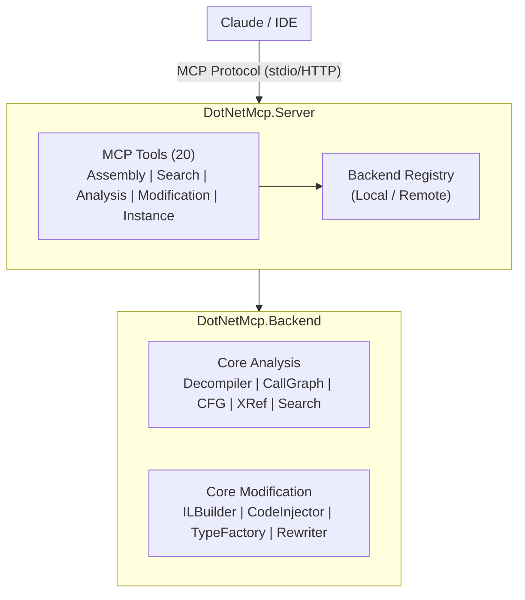
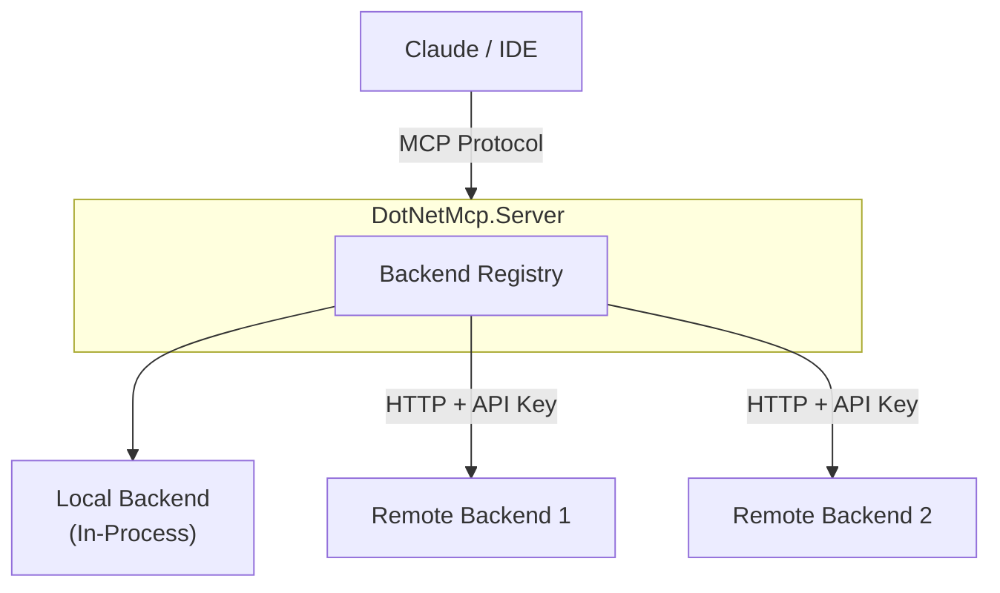

# DotNet MCP

English | [中文](README.zh.md)

> **v0.0.2-dev** - Pure C# Architecture, Unified MCP Server and Backend

A .NET assembly reverse engineering and modification tool based on MCP (Model Context Protocol).

## Overview

DotNet MCP is a tool that provides .NET assembly analysis and modification capabilities for AI assistants (like Claude). Through the MCP protocol, AI can:

- Load and analyze .NET assemblies (DLL/EXE)
- Decompile types and methods to C# source code or IL
- Search types, methods, and strings
- Analyze call graphs and control flow graphs
- Inject code and modify assemblies

## Architecture


```mermaid
flowchart TB
    subgraph Client["Claude / IDE"]
    end

    Client -->|"MCP Protocol (stdio/HTTP)"| Server

    subgraph Server["DotNetMcp.Server"]
        Tools["MCP Tools (20)<br/>Assembly | Search | Analysis | Modification | Instance"]
        Registry["Backend Registry<br/>(Local / Remote)"]
        Tools --> Registry
    end

    Server --> Backend

    subgraph Backend["DotNetMcp.Backend"]
        Analysis["Core Analysis<br/>Decompiler | CallGraph | CFG | XRef | Search"]
        Modification["Core Modification<br/>ILBuilder | CodeInjector | TypeFactory | Rewriter"]
    end
```

## Security

### API Key Authentication

The Backend service supports API Key authentication for HTTP endpoints.

**Quick Setup:**
```bash
export API_KEYS="your-secret-key"
```

**Supported Headers:**
- `X-API-Key: your-api-key`
- `Authorization: Bearer your-api-key`

**Excluded Paths:** `/`, `/health`, `/openapi` (no authentication required)

> **Note**: In production, always configure API keys. The system will log a critical warning if running in Production without API keys configured.

## Multi-Backend Architecture


```mermaid
flowchart TB
    Client["Claude / IDE"] -->|"MCP Protocol"| Server

    subgraph Server["DotNetMcp.Server"]
        Registry["Backend Registry"]
    end

    Registry --> Local["Local Backend<br/>(In-Process)"]
    Registry -->|"HTTP + API Key"| Remote1["Remote Backend 1"]
    Registry -->|"HTTP + API Key"| Remote2["Remote Backend 2"]
```

### Backend Management via AI

```
# Register backend with API Key authentication
User: Register remote backend http://server:5000 with API key "secret123"

AI: [Call register_remote_backend
     id="analysis-1"
     name="Analysis Server"
     endpoint="http://server:5000"
     apiKey="secret123"]

    Successfully registered remote backend "Analysis Server"

# List all backends
User: List all backends

AI: [Call list_backends]

    Available backends:
    - local (default) - Local, Healthy
    - analysis-1 - Remote, Healthy

# Set default backend
User: Use analysis-1 as default

AI: [Call set_default_backend id="analysis-1"]

    Default backend set to "analysis-1"
```

**Parameters for `register_remote_backend`:**

| Parameter | Required | Description |
|-----------|----------|-------------|
| `id` | Yes | Unique backend ID |
| `name` | Yes | Display name |
| `endpoint` | Yes | HTTP URL |
| `apiKey` | No | API Key for authentication |
| `timeoutSeconds` | No | Timeout (default: 30) |

## Quick Start

### Requirements

- .NET 10.0 SDK

### Build

```bash
dotnet build
```

### Running

#### 1. Stdio Mode (Claude Desktop)

```bash
dotnet run --project src/DotNetMcp.Server -- --stdio
```

#### 2. HTTP Mode

```bash
dotnet run --project src/DotNetMcp.Server
```

The service will start at `http://localhost:5000`.

### Claude Desktop Configuration

#### Quick Setup with Claude CLI

```bash
# HTTP Mode (start the server first, then add)
dotnet run --project src/DotNetMcp.Server &
claude mcp add dotnet-mcp --transport http --url http://localhost:5000/mcp

# Stdio Mode (using compiled executable)
claude mcp add dotnet-mcp -- /path/to/DotNetMcp.Server --stdio
```

#### Manual Configuration

Add to `claude_desktop_config.json`:

```json
{
  "mcpServers": {
    "dotnet-mcp": {
      "command": "dotnet",
      "args": [
        "run",
        "--project",
        "/path/to/DotNetMCP/src/DotNetMcp.Server",
        "--",
        "--stdio"
      ]
    }
  }
}
```

Or use the compiled executable:

```json
{
  "mcpServers": {
    "dotnet-mcp": {
      "command": "/path/to/DotNetMcp.Server",
      "args": ["--stdio"]
    }
  }
}
```

## MCP Tools

### Assembly Management (3)

| Tool | Description |
|------|-------------|
| `load_assembly` | Load a .NET assembly |
| `list_assemblies` | List loaded assemblies |
| `unload_assembly` | Unload an assembly |

### Search Tools (2)

| Tool | Description |
|------|-------------|
| `search_types` | Search types by keyword |
| `search_strings` | Search string literals |

### Analysis Tools (6)

| Tool | Description |
|------|-------------|
| `decompile_type` | Decompile type to C#/IL |
| `decompile_method` | Decompile method |
| `find_type_references` | Find type references |
| `find_method_calls` | Find method calls |
| `get_call_graph` | Build call graph |
| `get_control_flow_graph` | Build control flow graph |

### Modification Tools (4)

| Tool | Description |
|------|-------------|
| `inject_at_entry` | Inject code at method entry |
| `replace_method_body` | Replace method body |
| `add_type` | Add new type |
| `save_assembly` | Save modified assembly |

### Instance Management (5)

| Tool | Description |
|------|-------------|
| `list_backends` | List all backends |
| `register_remote_backend` | Register remote backend |
| `unregister_backend` | Unregister backend |
| `set_default_backend` | Set default backend |
| `check_backend_health` | Check backend health |

## Usage Examples

### Load and Analyze Assembly

```
User: Load /path/to/MyApp.dll and tell me what types it contains

AI: [Call load_assembly]
    [Call search_types keyword=""]

    Loaded assembly MyApp.dll, containing the following types:
    - MyApp.Program (class, 5 methods)
    - MyApp.Services.UserService (class, 10 methods)
    ...
```

### Decompile and Analyze

```
User: Decompile the UserService class

AI: [Call decompile_type typeName="MyApp.Services.UserService"]

    public class UserService
    {
        private readonly IDatabase _db;

        public User GetUser(int id)
        {
            return _db.Query<User>().FirstOrDefault(u => u.Id == id);
        }
        ...
    }
```

### Inject Code

```
User: Add logging at GetUser method entry

AI: [Call inject_at_entry
     methodFullName="MyApp.Services.UserService.GetUser"
     instructions=[
       {"opCode": "ldstr", "stringValue": "GetUser called"},
       {"opCode": "call", "stringValue": "System.Console::WriteLine"}
     ]]

    Logging code injected at GetUser method entry.
```

## Testing

```bash
# Run all tests
dotnet test

# Run Server tests only
dotnet test tests/DotNetMcp.Server.Tests

# Run Backend tests only
dotnet test tests/DotNetMcp.Backend.Tests
```

Current test status:
- Backend tests: 113 passed
- Server tests: 79 passed

## Project Structure

```
DotNetMCP/
├── src/
│   ├── DotNetMcp.Server/          # MCP Server
│   │   ├── Tools/                 # MCP Tool implementations
│   │   ├── Backend/               # Backend registration & management
│   │   └── Configuration/         # Configuration
│   └── DotNetMcp.Backend/         # Core Backend
│       ├── Core/
│       │   ├── Analysis/          # Analysis services
│       │   ├── Modification/      # Modification services
│       │   ├── Context/           # Assembly context
│       │   └── Identity/          # ID system
│       ├── Services/              # Business services
│       └── Controllers/           # HTTP API
├── tests/
│   ├── DotNetMcp.Server.Tests/    # Server unit tests
│   └── DotNetMcp.Backend.Tests/   # Backend unit tests
└── docs/
    ├── zh/                        # Chinese docs
    └── en/                        # English docs
```

## Tech Stack

- **.NET 10.0** - Runtime
- **ModelContextProtocol** - MCP SDK
- **Mono.Cecil** - Assembly manipulation
- **ICSharpCode.Decompiler** - Decompilation
- **Microsoft.CodeAnalysis** - Roslyn compilation

## Documentation

- [Getting Started](docs/en/getting-started.md)
- [Configuration](docs/en/configuration.md)
- [Tools Reference](docs/en/tools-reference.md)

## License

MIT
