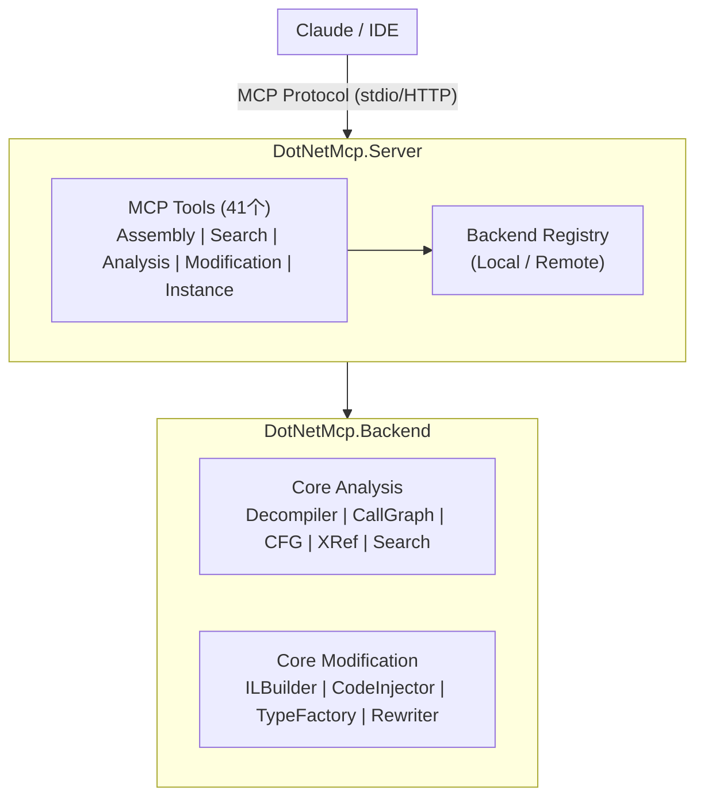
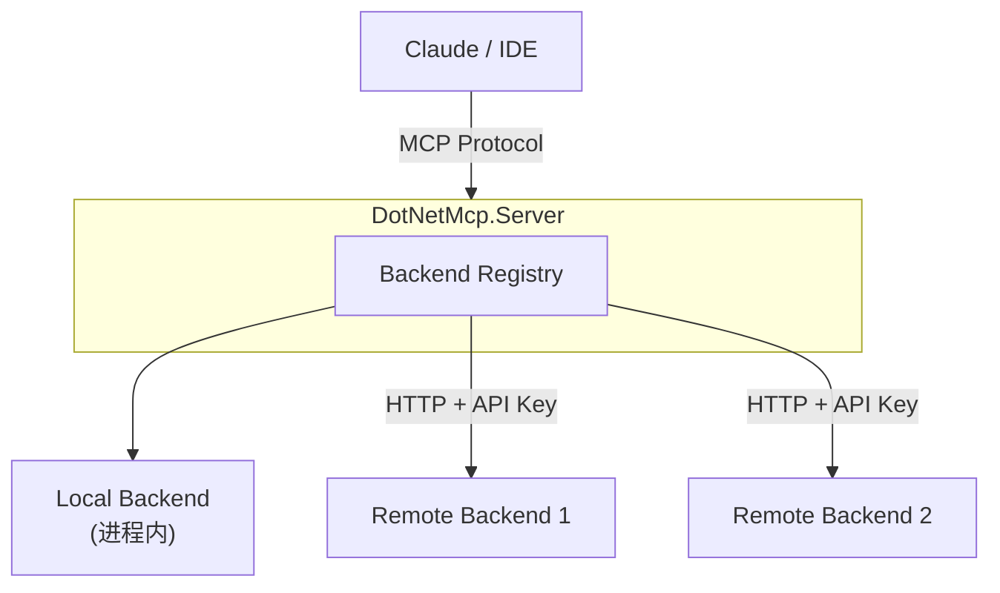

# DotNet MCP

[English](README.md) | 中文

> **v0.0.3** - 纯 C# 架构，MCP Server 与 Backend 统一

基于 MCP (Model Context Protocol) 的 .NET 程序集逆向工程和修改工具。

## 文档

- [快速开始指南](docs/zh/getting-started.md)
- [配置说明](docs/zh/configuration.md)
- [工具参考](docs/zh/tools-reference.md)

## 项目概述

DotNet MCP 是一个为 AI 助手（如 Claude）提供 .NET 程序集分析和修改能力的工具。通过 MCP 协议，AI 可以：

- 加载和分析 .NET 程序集（DLL/EXE）
- 反编译类型和方法为 C# 源码或 IL
- 搜索类型、方法和字符串（支持正则 / 高级语法）
- 分析调用图、控制流图和依赖图
- 检测继承关系、接口实现、方法覆盖
- 检测设计模式（Singleton、Factory、Observer 等）
- 检测程序集混淆并识别混淆器
- 自动探测 Unity 游戏目录
- 注入代码和修改程序集

## 架构



## 安全

### API Key 认证

Backend 服务支持 HTTP 端点的 API Key 认证。

**快速配置：**
```bash
export API_KEYS="your-secret-key"
```

**支持的请求头：**
- `X-API-Key: your-api-key`
- `Authorization: Bearer your-api-key`

**排除路径：** `/`、`/health`、`/openapi`（无需认证）

> **注意**：生产环境中请务必配置 API Keys。如果在生产环境中未配置 API Keys，系统将记录严重警告。

## 多后端架构



### 通过 AI 管理后端

```
# 注册带 API Key 认证的后端
用户: 注册远程后端 http://server:5000，API key 为 "secret123"

AI: [调用 register_remote_backend
     id="analysis-1"
     name="Analysis Server"
     endpoint="http://server:5000"
     apiKey="secret123"]

    成功注册远程后端 "Analysis Server"

# 列出所有后端
用户: 列出所有后端

AI: [调用 list_backends]

    可用后端：
    - local (默认) - Local, Healthy
    - analysis-1 - Remote, Healthy

# 设置默认后端
用户: 使用 analysis-1 作为默认后端

AI: [调用 set_default_backend id="analysis-1"]

    默认后端已设置为 "analysis-1"
```

**`register_remote_backend` 参数：**

| 参数 | 必需 | 说明 |
|------|------|------|
| `id` | 是 | 唯一后端 ID |
| `name` | 是 | 显示名称 |
| `endpoint` | 是 | HTTP URL |
| `apiKey` | 否 | 认证用 API Key |
| `timeoutSeconds` | 否 | 超时时间（默认: 30） |

## 快速开始

### 环境要求

- .NET 10.0 SDK

### 编译

```bash
dotnet build
```

### 运行方式

#### 1. Stdio 模式（Claude Desktop）

```bash
dotnet run --project src/DotNetMcp.Server -- --stdio
```

#### 2. HTTP 模式

```bash
dotnet run --project src/DotNetMcp.Server
```

服务将在 `http://localhost:5000` 启动。

### Claude Desktop 配置

#### 使用 Claude CLI 快速配置

```bash
# HTTP 模式（先启动服务，再添加）
dotnet run --project src/DotNetMcp.Server &
claude mcp add dotnet-mcp --transport http --url http://localhost:5000/mcp

# Stdio 模式（使用编译后的可执行文件）
claude mcp add dotnet-mcp -- /path/to/DotNetMcp.Server --stdio
```

#### 手动配置

在 `claude_desktop_config.json` 中添加：

```json
{
  "mcpServers": {
    "dotnet-mcp": {
      "command": "dotnet",
      "args": [
        "run",
        "--project",
        "/path/to/DotNetMCP/src/DotNetMcp.Server",
        "--",
        "--stdio"
      ]
    }
  }
}
```

或使用已编译的可执行文件：

```json
{
  "mcpServers": {
    "dotnet-mcp": {
      "command": "/path/to/DotNetMcp.Server",
      "args": ["--stdio"]
    }
  }
}
```

## MCP 工具列表

### 程序集管理 (4)

| 工具 | 说明 |
|------|------|
| `load_assembly` | 加载 .NET 程序集 |
| `list_assemblies` | 列出已加载的程序集 |
| `unload_assembly` | 卸载程序集 |
| `detect_unity_assembly` | 自动探测 Unity 游戏目录中的 Assembly-CSharp.dll |

### 搜索工具 (2)

| 工具 | 说明 |
|------|------|
| `search_types` | 按关键词搜索类型 |
| `search_strings` | 搜索字符串字面量 |

### 分析工具 (20)

| 工具 | 说明 |
|------|------|
| `decompile_type` | 反编译类型为 C#/IL（支持 PDB 原始源码） |
| `decompile_method` | 精确反编译单个方法 |
| `find_type_references` | 查找类型引用 |
| `find_method_calls` | 查找方法调用 |
| `get_call_graph` | 构建调用图 |
| `get_control_flow_graph` | 构建控制流图（含 Mermaid） |
| `get_type_outline` | 获取类型元数据大纲（无需反编译） |
| `plan_chunking` | 规划 LLM 友好的源码分块方案 |
| `compare_assemblies` | 对比两个程序集的结构差异 |
| `batch_decompile` | 批量反编译多个成员 |
| `get_dependency_graph` | 构建程序集/命名空间/类型依赖图（含 Mermaid） |
| `detect_design_patterns` | 检测 Singleton、Factory、Observer 等设计模式 |
| `find_base_types` | 查找类型的基类链和接口 |
| `find_derived_types` | 查找继承自指定类型的所有派生类型 |
| `get_implementations` | 查找接口的所有实现类型 |
| `get_overrides` | 查找虚方法/抽象方法的所有覆盖实现 |
| `get_overloads` | 查找方法的所有重载 |
| `enhanced_search` | 统一搜索入口，支持正则 / +/-/ 精确 / 模糊 / Token 等高级语法 |
| `detect_obfuscation` | 混淆检测，识别混淆器，0-100 评分 |
| `warm_index` | 预构建类型和成员索引，加速后续查询 |

### 修改工具 (6)

| 工具 | 说明 |
|------|------|
| `inject_at_entry` | 在方法入口注入代码 |
| `replace_method_body` | 用原始 IL 指令替换方法体 |
| `replace_method_body_with_csharp` | 用 C# 源码替换方法体（Roslyn 编译 + Cecil 合并） |
| `add_type` | 添加新类型 |
| `save_assembly` | 保存修改后的程序集 |
| `generate_patch_skeleton` | 生成 Harmony Patch 骨架代码 |

### 实例管理

#### 后端管理 (5)

| 工具 | 说明 |
|------|------|
| `list_backends` | 列出所有后端 |
| `register_remote_backend` | 注册远程后端 |
| `unregister_backend` | 注销后端 |
| `set_default_backend` | 设置默认后端 |
| `check_backend_health` | 检查后端健康状态 |

#### 程序集 Alias 管理 (4)

| 工具 | 说明 |
|------|------|
| `register_assembly_alias` | 为已加载程序集的 MVID 注册短 alias |
| `unregister_assembly_alias` | 删除已注册的 alias |
| `list_assembly_aliases` | 列出所有已注册的 alias（alias → MVID 映射） |
| `instance_restore_persisted` | 从上次会话持久化的 alias 恢复程序集 |

## 使用示例

### 加载并分析程序集

```
用户: 加载 /path/to/MyApp.dll 并告诉我有哪些类型

AI: [调用 load_assembly]
    [调用 search_types keyword=""]

    已加载程序集 MyApp.dll，包含以下类型：
    - MyApp.Program (class, 5 methods)
    - MyApp.Services.UserService (class, 10 methods)
    ...
```

### 反编译和分析

```
用户: 反编译 UserService 类

AI: [调用 decompile_type typeName="MyApp.Services.UserService"]

    public class UserService
    {
        private readonly IDatabase _db;

        public User GetUser(int id)
        {
            return _db.Query<User>().FirstOrDefault(u => u.Id == id);
        }
        ...
    }
```

### 注入代码

```
用户: 在 GetUser 方法入口添加日志

AI: [调用 inject_at_entry
     methodFullName="MyApp.Services.UserService.GetUser"
     instructions=[
       {"opCode": "ldstr", "stringValue": "GetUser called"},
       {"opCode": "call", "stringValue": "System.Console::WriteLine"}
     ]]

    已在 GetUser 方法入口注入日志代码。
```

## 测试

```bash
# 运行所有测试
dotnet test

# 仅运行 Server 测试
dotnet test tests/DotNetMcp.Server.Tests

# 仅运行 Backend 测试
dotnet test tests/DotNetMcp.Backend.Tests
```

当前测试状态：
- Backend 测试：135 个 ✅
- Server 测试：96 个 ✅

## 项目结构

```
DotNetMCP/
├── src/
│   ├── DotNetMcp.Server/          # MCP Server
│   │   ├── Tools/                 # MCP 工具实现
│   │   ├── Backend/               # 后端注册与管理
│   │   └── Configuration/         # 配置
│   └── DotNetMcp.Backend/         # 核心后端
│       ├── Core/
│       │   ├── Analysis/          # 分析服务
│       │   ├── Modification/      # 修改服务
│       │   ├── Context/           # 程序集上下文
│       │   └── Identity/          # ID 系统
│       ├── Services/              # 业务服务
│       └── Controllers/           # HTTP API
├── tests/
│   ├── DotNetMcp.Server.Tests/    # Server 单元测试
│   └── DotNetMcp.Backend.Tests/   # Backend 单元测试
└── docs/
    ├── zh/                        # 中文文档
    └── en/                        # English docs
```

## 技术栈

- **.NET 10.0** - 运行时
- **ModelContextProtocol** - MCP SDK
- **Mono.Cecil** - 程序集操作
- **ICSharpCode.Decompiler** - 反编译
- **Microsoft.CodeAnalysis** - Roslyn 编译

## Docker 部署

### 构建镜像

```bash
docker build -t dotnet-mcp .
```

### 运行（HTTP 模式）

```bash
docker run -p 5000:5000 dotnet-mcp
```

服务将在 `http://localhost:5000` 启动。
健康检查端点：`http://localhost:5000/health`

### 带 API Key 运行

```bash
docker run -p 5000:5000 -e API_KEYS="your-secret-key" dotnet-mcp
```

### 环境变量

| 变量 | 默认值 | 说明 |
|------|--------|------|
| `ASPNETCORE_URLS` | `http://+:5000` | 监听地址 |
| `API_KEYS` | *(无)* | 逗号分隔的 API Key 列表，用于认证 |
| `TZ` | `UTC` | 时区 |

> **注意**：Stdio 模式（`--stdio`）不适用于 Docker 容器。请使用 HTTP 模式，通过 `http://localhost:5000/mcp` 连接 Claude。

## License

MIT
